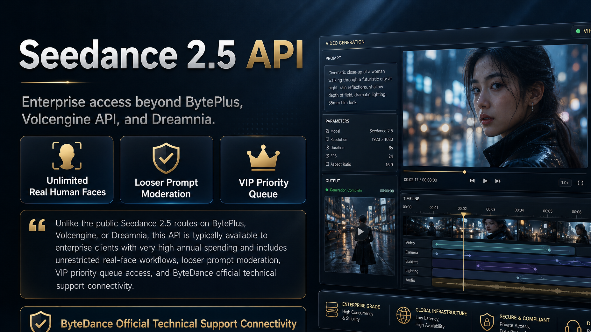

Last updated on 11:33:05 17-07-2026

# Seedance 2.5 API 中文说明

[English README](./README.md) | [API 入口](https://cyberbara.com/api) | [获取 API Key](https://cyberbara.com/api) | [Awesome Seedance](https://github.com/ZeroLu/awesome-seedance)



通过 CyberBara 接入 **满血版 Seedance 2.5 API**。

这里强调的不是普通公开入口，而是更接近企业大客户能力的一条接入路径。它和 BytePlus、火山引擎 API、以及 Dreamina 官网可见的 Seedance 2.5 不是一回事。这个版本主打三点：

- **无限制真实人脸**
- **更宽松的提示词审核**
- **VIP 优先队列**

如果你做的是广告、真人口播、角色视频、短剧测试、达人素材、批量化工作流，这几个差异会直接决定你能不能稳定跑起来。

安装：

```bash
pip install seedance25-api
```

或者使用 npm：

```bash
npm install seedance25-api
```

[快速开始](#快速开始) | [能力对比](#能力对比) | [API 示例](#api-示例) | [FAQ](#faq)

---

## 这份仓库解决什么问题

很多人搜的是：

- `Seedance 2.5 API`
- `Seedance 2.5 Python SDK`
- `Seedance 2.5 文生视频 API`
- `Seedance 2.5 图生视频 API`
- `Seedance 2.5 真实人脸`
- `如何接入 Seedance 2.5`

但网上大部分内容只停留在发布消息、体验截图、或者公开页面入口，真正关键的问题没有讲清楚：

- 公开网页能不能等于 API 能力
- 标准云 API 能不能等于满血企业能力
- 真实人脸、审核尺度、队列优先级到底差在哪里

这个仓库就是把这些问题直接讲透。

---

## 为什么强调“满血版”

很多开发者第一次接触 Seedance 2.5 时，会默认认为下面这些入口能力差不多：

- BytePlus API
- 火山引擎 API
- Dreamina 官网 Seedance 2.5
- 某些对外公开的体验页面

实际不是。

对于很多真正做生产的人来说，最关键的不是“能不能生成一个视频”，而是：

- 能不能稳定跑 **真实人脸**
- 提示词会不会经常被拦
- 高峰期会不会排队很久
- 能不能用统一 API 做上传、生成、轮询、复用素材

CyberBara 这里强调的是更接近 **企业满血版能力** 的接入路径。

---

## 能力对比

| 接入方式 | 典型用户 | 真实人脸 | 提示词审核 | 队列优先级 | 适合什么场景 |
| --- | --- | --- | --- | --- | --- |
| **CyberBara 满血版 Seedance 2.5 API** | 开发者、工作室、广告团队、增长团队、产品团队 | **无限制真实人脸** | **更宽松** | **VIP 优先队列** | 适合真正要做 API 集成和批量生产的人 |
| BytePlus / 火山引擎标准 API | 标准云客户 | 一般更受限 | 一般更严格 | 普通队列 | 适合常规云采购，但不是这里强调的满血能力 |
| Dreamina 官网 Seedance 2.5 | 普通创作者、网页用户 | 通常限制更多 | 公开产品审核规则 | 公共队列 | 适合试用和体验，不适合完整 API 工作流 |
| 直签企业满血通道 | 大型企业客户 | 按合同开放 | 按合同开放 | 高优先级 | 常见于年支出很高的企业级采购 |

一句话理解：

如果你在意的是 **真实人脸、审核宽松度、队列优先级、API 自动化**，那你不应该把它和公开网页体验放在一起比较，而应该和企业级满血接入能力比较。

---

## 适合谁

这份仓库尤其适合下面这些人：

- 需要做 **真人视频工作流** 的开发者和团队
- 做 **广告素材、UGC 素材、达人视频、短剧测试、数字人参考视频** 的工作室和内容团队
- 正在做 **AI 视频产品、创作者工具、内部自动化生产链路** 的产品或工程团队
- 很在意 **真实人脸权限、审核宽松度、排队速度、API 自动化能力** 的团队
- 想找的不是公开试玩入口，而是更接近 **企业满血版能力** 接入路径的人

如果你只是想要下面这些东西，这个仓库可能不是你的第一选择：

- 纯网页试玩
- 一次性体验一下效果
- 不需要 API、上传、轮询、素材复用的简单测试

---

## 快速开始

### 1. 获取 API Key

前往 CyberBara 创建账号并生成 API Key：

- API 入口: [https://cyberbara.com/api](https://cyberbara.com/api)

### 2. Base URL

```text
https://cyberbara.com
```

### 3. 鉴权方式

你可以使用：

```http
Authorization: Bearer <YOUR_API_KEY>
```

或者：

```http
x-api-key: <YOUR_API_KEY>
```

---

## Python 封装

这个仓库自带了一个最小可用的 Python Wrapper，方便你直接把 Seedance 2.5 接进自己的服务。

安装：

```bash
pip install seedance25-api
```

本地开发安装：

```bash
pip install -e .
```

文生视频示例：

```python
from seedance25_api import Seedance25Client

client = Seedance25Client("YOUR_API_KEY")

created = client.text_to_video(
    "A cinematic drone shot over a misty mountain village at sunrise.",
    duration="10",
    aspect_ratio="16:9",
)

task = client.wait_for_task(created["task_id"])
print(task["output"]["videos"])
```

图生视频示例：

```python
from seedance25_api import Seedance25Client

client = Seedance25Client("YOUR_API_KEY")
upload = client.upload_images(["./reference.png"])

created = client.image_to_video(
    "The subject turns slowly toward camera, subtle smile, natural skin texture.",
    image_urls=upload["urls"],
    duration="10",
    aspect_ratio="9:16",
)

task = client.wait_for_task(created["task_id"])
print(task["output"]["videos"])
```

可用方法：

- `models()`
- `quote_video()`
- `text_to_video()`
- `image_to_video()`
- `upload_images()`
- `upload_videos()`
- `get_task()`
- `wait_for_task()`

---

## Node.js 封装

这个仓库也提供了一个零依赖的 Node.js Wrapper，适合直接接到你的服务端、工作流脚本或内部工具里。

安装：

```bash
npm install seedance25-api
```

文生视频示例：

```js
const { Seedance25Client } = require("seedance25-api");

async function main() {
  const client = new Seedance25Client(process.env.CYBERBARA_API_KEY);

  const created = await client.textToVideo(
    "A cinematic drone shot over a misty mountain village at sunrise.",
    {
      duration: "10",
      aspectRatio: "16:9"
    }
  );

  const task = await client.waitForTask(created.task_id);
  console.log(task.output?.videos || []);
}

main().catch(console.error);
```

图生视频示例：

```js
const { Seedance25Client } = require("seedance25-api");

async function main() {
  const client = new Seedance25Client(process.env.CYBERBARA_API_KEY);
  const upload = await client.uploadImages(["./reference.png"]);

  const created = await client.imageToVideo(
    "The subject turns slowly toward camera, subtle smile, natural skin texture.",
    {
      imageUrls: upload.urls,
      duration: "10",
      aspectRatio: "9:16"
    }
  );

  const task = await client.waitForTask(created.task_id);
  console.log(task.output?.videos || []);
}

main().catch(console.error);
```

可用方法：

- `models()`
- `quoteVideo()`
- `createVideo()`
- `textToVideo()`
- `imageToVideo()`
- `uploadImages()`
- `uploadVideos()`
- `getTask()`
- `waitForTask()`

示例文件：

- [examples/text_to_video.mjs](./examples/text_to_video.mjs)
- [examples/image_to_video.mjs](./examples/image_to_video.mjs)

---

## API 示例

### 1. 获取视频模型列表

```bash
curl -X GET 'https://cyberbara.com/api/v1/models?media_type=video' \
  -H 'Authorization: Bearer <YOUR_API_KEY>'
```

建议先调用这个接口，确认当前可用模型名和场景。

### 2. 上传参考图

```bash
curl -X POST 'https://cyberbara.com/api/v1/uploads/images' \
  -H 'Authorization: Bearer <YOUR_API_KEY>' \
  -F 'files=@./reference.png'
```

返回值里会给你可复用的上传 URL。

### 3. 创建文生视频任务

```bash
curl -X POST 'https://cyberbara.com/api/v1/videos/generations' \
  -H 'Authorization: Bearer <YOUR_API_KEY>' \
  -H 'Content-Type: application/json' \
  -d '{
    "model": "seedance-2.5",
    "scene": "text-to-video",
    "prompt": "A cinematic drone shot over a misty mountain village at sunrise, realistic lighting, smooth camera motion, atmospheric depth.",
    "options": {
      "duration": "10",
      "aspect_ratio": "16:9"
    }
  }'
```

### 4. 创建图生视频任务

```bash
curl -X POST 'https://cyberbara.com/api/v1/videos/generations' \
  -H 'Authorization: Bearer <YOUR_API_KEY>' \
  -H 'Content-Type: application/json' \
  -d '{
    "model": "seedance-2.5",
    "scene": "image-to-video",
    "prompt": "The woman turns slowly toward camera, soft wind in her hair, natural eye movement, subtle smile, realistic skin texture, cinematic portrait motion.",
    "options": {
      "duration": "10",
      "aspect_ratio": "9:16",
      "image_input": [
        "https://your-uploaded-image-url-here"
      ]
    }
  }'
```

### 5. 查询任务状态

```bash
curl -X GET 'https://cyberbara.com/api/v1/tasks/<TASK_ID>' \
  -H 'Authorization: Bearer <YOUR_API_KEY>'
```

### 6. 生成前先询价

```bash
curl -X POST 'https://cyberbara.com/api/v1/credits/quote' \
  -H 'Authorization: Bearer <YOUR_API_KEY>' \
  -H 'Content-Type: application/json' \
  -d '{
    "model": "seedance-2.5",
    "media_type": "video",
    "scene": "image-to-video",
    "prompt": "Portrait motion test",
    "options": {
      "duration": "10",
      "aspect_ratio": "9:16"
    }
  }'
```

---

## 为什么这条路适合真人视频工作流

很多团队真正卡住的地方，不是“不会调接口”，而是：

- 一上真人脸就被限制
- 提示词稍微敏感一点就过不了
- 高峰期排队太久，影响产能

如果你做的是：

- 真人口播
- 达人素材
- 美妆服饰广告
- 虚拟人 / 数字人参考视频
- 短剧角色测试
- 电商素材批量生产

那你更应该关心：

- **无限制真实人脸**
- **更宽松的提示词审核**
- **VIP 优先队列**

这三点才是“能不能进入生产环境”的分水岭。

---

## FAQ

### 这和 BytePlus、火山引擎、Dreamina 官网的 Seedance 2.5 是一样的吗？

不是。

这份仓库要强调的核心就是：**它们不是同一条接入能力线**。公开网页、标准云 API、企业满血通道，本来就不是同一个东西。

### “满血版”具体指什么？

对大多数开发者来说，最重要的就是这三点：

- **无限制真实人脸**
- **更宽松的提示词审核**
- **VIP 优先队列**

如果没有这三点，很多真人商业工作流根本跑不顺。

### 为什么要强调企业级客户、千万年支出这种说法？

因为这一档能力通常不是普通公开入口默认给到的，而更像是企业大客户能力。很多时候，只有年支出非常高的客户，才有机会直接拿到类似权限。

CyberBara 的价值就在于：让更多开发者和团队可以更实际地接近这条能力线，而不是只能停留在公开体验层。

### 适合什么样的团队？

适合需要真实人脸、批量生成、自动化工作流、或者希望减少审核和排队损耗的团队。

### 这只是一个演示仓库吗？

不是。它是面向真实集成的，包含上传、生成、轮询、素材复用、Python 封装这些真正会用到的能力。

### 去哪里拿灵感和提示词？

- [Awesome Seedance](https://github.com/ZeroLu/awesome-seedance)
- [Seedance How-to](https://github.com/ZeroLu/seedance2.0-how-to)

---

## 免责声明

本仓库仅用于开发接入与教育说明。涉及真实人物素材时，请遵守平台规则、取得必要授权，并遵守当地法律法规。
